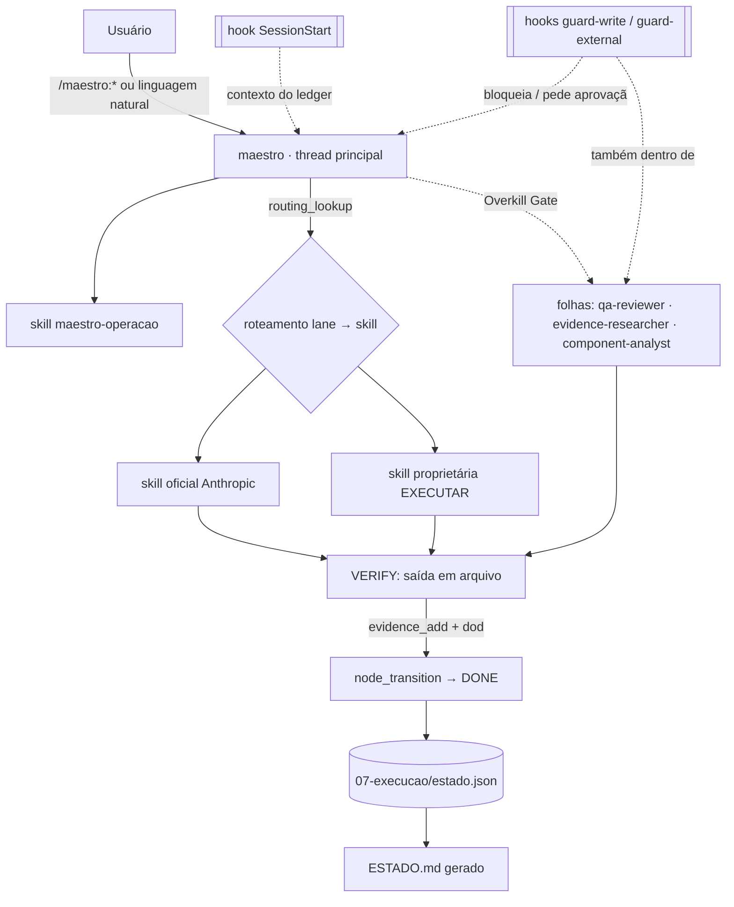

# Arquitetura do Maestro

> O Maestro é o **tradutor entre vocabulários de estado** e o **roteador único** entre skills oficiais Anthropic e
> skills proprietárias EXECUTAR — distribuído como Claude Code Plugin. Origem do desenho: pacote Maestro (ING-0002),
> hipótese H-arq-1 (`mapa/maestro-topologia.md`), ajustada pelas decisões registradas em [decisions.md](decisions.md).

## Camadas

| Camada | Responsabilidade | Neste plugin |
|---|---|---|
| **Agent** | raciocínio / orquestração | `maestro` (thread principal) + folhas `qa-reviewer`, `evidence-researcher`, `component-analyst` |
| **Skill** | conhecimento + procedimento | `maestro-operacao`, `roteamento-lanes`, `estagios-bpm`, `component-ingestion`, `component-authoring` |
| **Command** | entrada explícita de workflow | `/maestro:estado`, `executar`, `verificar`, `decidir`, `ingerir`, `validar`, `catalogo` |
| **MCP Tool** | capacidade executável | servidores `estado` (13 ferramentas) e `registry` (12) — ver [mcp.md](mcp.md) |
| **Hook** | comportamento / eventos | `session-context`, `guard-write`, `guard-external`, `validate-on-write` |

Regra de ouro: **invariante que não pode depender de o modelo "lembrar" é imposta por MCP (regra de negócio) ou hook (evento)**;
skills explicam o procedimento; commands só dão a entrada; agents raciocinam e delegam.

## Fluxo



## Trilhas e ledger

- **Trilha S — construir o Maestro:** estágios E0–E9 (ciclo BPM e Qualidade estendido para agentes) + ingestões (`ING-NNNN`) + tarefas. Dono canônico: `repo`.
- **Trilha L — operar o lançamento PEM-D16:** fases F0–F8; abre só após o gate de E6. Dono canônico: `control-center` (projeção; D1 aberta).
- **Ledger único:** `07-execucao/estado.json` (schema `catalog/schema/estado.schema.json`). `ESTADO.md` é projeção gerada. Máquina de estados: [state-machine.md](state-machine.md).

## Catálogo e ingestão

- **Catálogo** (`catalog/components/**`) é a fonte de verdade dos componentes; o validador cruza catálogo × disco × manifesto MCP.
- **Ingestão** (`ingestion/`) é o único caminho de entrada de componentes: [process/ingestion-pipeline.md](../process/ingestion-pipeline.md).
- **Upstream** (`vendor/upstream/`, submodules fixados) é referência somente leitura; nada de lá é carregado pelo plugin.

## Resolução do workspace

Servidores MCP e hooks descobrem onde estão ledger/catálogo: `MAESTRO_WORKSPACE` → `cwd` (subindo diretórios até `07-execucao/estado.json` ou `catalog/components`) → `CLAUDE_PROJECT_DIR` → raiz do plugin (somente leitura, **só para o catálogo**). O ledger **nunca** usa a raiz do plugin: num projeto sem ledger, `state_summary` responde `NOT_INITIALIZED` e o Maestro oferece `state_init` (achado do eval EV-014 — antes lia o ledger do repositório do plugin, um estado paralelo). Hooks **só agem** em workspace do Maestro — o plugin habilitado em outro projeto não interfere.

Neste repositório, raiz do plugin = raiz do projeto: por isso `.claude/settings.json` desativa as cópias de projeto do `.mcp.json` (`disabledMcpjsonServers`) — sem isso os servidores apareciam duplicados e as cópias de projeto falhavam por não terem `${CLAUDE_PLUGIN_ROOT}` (verificado nesta sessão).

## Estrutura do repositório

```
.claude-plugin/        plugin.json (manifesto) · marketplace.json (repo instalável)
.claude/settings.json  desenvolvimento: plugin-dev habilitado; duplicatas MCP de projeto desativadas
.mcp.json              servidores MCP do plugin (estado, registry)
agents/ skills/ commands/ hooks/hooks.json     componentes carregados (sem README dentro de agents/ e commands/!)
src/                   TypeScript: lib/ (regras), mcp/ (servidores + manifesto), hooks/, cli/
dist/                  bundles esbuild versionados — o plugin roda só com Node, sem npm install
contratos/             C-00…C-04 (regras que tudo obedece)
mapa/                  inventário, matriz, F0–F8, ficha, divergências, roteamento.json (+ .md gerado)
07-execucao/           ledger (estado.json + ESTADO.md gerado) e artefatos dos estágios
catalog/               registros de componentes, schemas JSON, CATALOG.md gerado
ingestion/             inbox/ → received/ (imutável) → records/ (ING-NNNN)
docs/                  arquitetura, processo, manutenção
tests/ evals/ scripts/ unit/integração/repo · casos de plugin eval · check, e2e, upstream-sync
vendor/upstream/       claude-plugins-official, knowledge-work-plugins (submodules fixados)
```

## Limites conhecidos (v0.1.0)

- Trilha L lê/projeta o Control Center apenas quando os contratos do Copiloto (`drive-bindings.json`, `state-contract.json`) forem fornecidos — hoje `USER_ACTION_REQUIRED`.
- A tabela de mapeamento de estados (C-01) e o roteamento são **HIPÓTESE** até E2.
- Folhas não podem ser impedidas por ferramenta de usar `Bash` para escrever (o `qa-reviewer` tem Bash para rodar verificações); a mitigação é o prompt + revisão. Registrado para o FMEA (E3).
