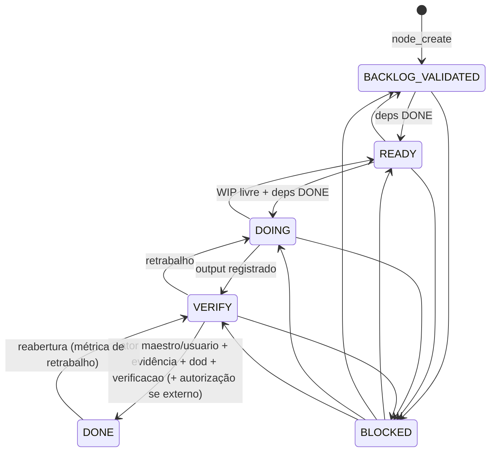

# Máquina de estados do nó (C-01)

| Guarda | Código de recusa | Invariante |
|---|---|---|
| Só um `DOING` no ledger inteiro | `WIP` | I-01 |
| `DOING`/`READY` exigem dependências `DONE` | `DEPS` | dependência vence ordem numérica |
| `DOING → VERIFY` exige `output` ou evidência | `OUTPUT` | saída nunca só no chat |
| `DONE` só de `VERIFY` | `NOT_ALLOWED` | saída de skill é rascunho (EV-011) |
| `DONE` exige evidência | `EVIDENCE` | I-04 (EV-002) |
| `DONE` exige `dod` ≠ `A DEFINIR` | `DOD` | I-02 + I-04 |
| `DONE` exige `verificacao` | `VERIFICACAO` | I-04 |
| `DONE` só por `maestro`/`usuario` | `PROMOTER` | C-04 regra 1 |
| efeito externo sem autorização → `BLOCKED` + `USER_ACTION_REQUIRED` | `AUTORIZACAO` | I-05 (EV-003) |
| `BLOCKED` exige `{codigo, detalhe}` | `BLOQUEIO` | rastreabilidade |
| toda transição exige `motivo` e é anexada ao `historico` | `MOTIVO` | I-10 |
| ao entrar em `DONE`, dependentes com todas as dependências concluídas vão de `BACKLOG_VALIDATED` para `READY` (automático, ator `maestro`) | — | regra do Copiloto |

Auditoria global (`state_validate`, `maestro validate`): WIP, DONE sem evidência/dod/autorização, dependências inexistentes, ciclos, histórico incoerente, decisão `RESPONDIDA` sem fonte, projeção `ESTADO.md` divergente e ledger paralelo (EV-012).

Implementação: `src/lib/estado/machine.ts` (guardas), `validate.ts` (auditoria), `render.ts` (projeção), testes em `tests/unit/machine.test.ts` e `tests/integration/mcp-estado.test.ts`.
