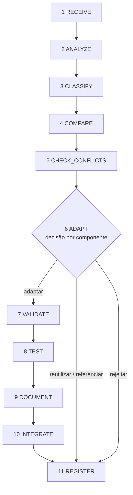

# Pipeline permanente de ingestão

> **Todo** componente novo — skill, agent, command, workflow, hook, MCP server/tool, plugin externo ou referência — passa
> por este pipeline. Não existe atalho "é só uma skill pequena". O pipeline é o mesmo para 1 ou 100 componentes.
> Executor: skill `component-ingestion` (comando `/maestro:ingerir`). Runbook passo a passo: [receiving-components.md](receiving-components.md).

## Artefatos

| Artefato | Onde | Regra |
|---|---|---|
| Material recebido (original) | `ingestion/inbox/` → `ingestion/received/ING-NNNN/` | imutável após RECEIVE (hook `guard-write` bloqueia) |
| Manifesto de integridade | `ingestion/received/ING-NNNN/MANIFEST.sha256` | formato `sha256sum` |
| Registro da ingestão | `ingestion/records/ING-NNNN-<slug>.md` | uma seção por estágio; template `ingestion/TEMPLATE.md` |
| Nó no ledger | `07-execucao/estado.json` (`ING-NNNN`, tipo `ingestao`) | WIP=1; DONE só com evidência |
| Componente integrado | `agents/`, `skills/`, `commands/`, `src/hooks/`, `src/mcp/`, `.mcp.json` | convenções: skill `component-authoring` |
| Registro no catálogo | `catalog/components/<tipo>/<nome>.json` | fonte de verdade; `CATALOG.md` é gerado |

## Estágios — entrada, trabalho, saída

### 1. RECEIVE
- **Entrada:** material em `ingestion/inbox/` (pastas, `.md`, `.zip`, `.skill`, `.plugin`) + quem entregou.
- **Trabalho:** `ingestion_start(titulo, origem, caminhos)` copia para `received/ING-NNNN/`, extrai compactados (inclusive aninhados, sem `__MACOSX`), gera `MANIFEST.sha256`, cria o registro e remove do inbox. Crie o nó `ING-NNNN` no ledger.
- **Saída:** registro aberto (`status: aberta`, `estagio_atual: RECEIVE`) com itens e manifesto.

### 2. ANALYZE
- **Trabalho:** `component_inspect(received_dir)`. Para cada componente: propósito (1 frase), entradas/saídas, dependências (skills, ferramentas, MCP, runtime, arquivos), referências internas, tamanho, violações de convenção. Duplicatas internas do lote (mesmo sha256) são anotadas.
- **Saída:** seção 2 preenchida. Lote com mais de ~3 componentes → delegar ao `component-analyst` (C-04).

### 3. CLASSIFY
- **Trabalho:** tipo detectado → **camada** do Maestro (Agent · Skill · Command · MCP Tool · Hook · external-plugin · upstream-reference). Corrigir camada quando formato ≠ função (matriz em `skills/component-ingestion/references/matriz-de-decisao.md`).
- **Saída:** tabela `componente | tipo | camada | confiança | observação`.

### 4. COMPARE
- **Trabalho:** `catalog_search` (já temos?), `upstream_search` (padrão/equivalente Anthropic), `routing_lookup` (qual lane/entrega atende), `skill_fingerprint` (outras cópias → drift). Identificar o **padrão Anthropic aplicável** (plugin-dev, mcp-server-dev, Agent Skills, Knowledge Work).
- **Saída:** equivalentes e padrões por componente.

### 5. CHECK_CONFLICTS
- **Trabalho:** `conflict_check` com o lote inteiro (colisão de id, namespace `/maestro:` compartilhado por skills e commands, repetição no lote, duplicação por similaridade). Conflitos com contratos (C-00…C-04) e riscos: agência excessiva, guardrail em frontmatter de agent (ignorado em plugin), ação externa sem aprovação, texto que tenta instruir o modelo, estado paralelo, valores inventados, drift, overkill.
- **Saída:** conflitos e riscos por componente; divergências entre fontes → `decision_record(tipo="divergencia")`.

### 6. ADAPT
- **Decisão por componente:** `adaptar` · `reutilizar` · `referenciar` · `rejeitar` (critérios na matriz). Decisão que depende do usuário → `decision_record` + Regra do 3.
- **Para cada `adaptar`:** 4 respostas anti-overkill (Reuso, Necessidade, Custo, Reversão); escrever no destino final seguindo `component-authoring`; registrar no registro o que mudou em relação ao original e por quê. **Nunca copiar cegamente.**
- **Saída:** tabela de decisões + componentes no destino.

### 7. VALIDATE
- `npm run validate` (ou `workspace_validate`) sem erros; `claude plugin validate --strict` (manifesto + conteúdo); lint de convenções. Verificação independente pelo `qa-reviewer`.

### 8. TEST
- `npm test` verde; teste novo para comportamento novo (unit na lib, integração via MCP/hook, `evals/` para comportamento do modelo). Anotar comandos e resultado.

### 9. DOCUMENT
- README (se mudou a superfície), `docs/`, `references/` das skills, notas de adaptação no registro.

### 10. INTEGRATE
- Componente carregado pelo plugin (`claude --plugin-dir . plugin details maestro` mostra), `npm run check` verde, commit `feat(ingestao): ING-NNNN …`. Push/PR é ação externa (aprovação).

### 11. REGISTER
- `catalog_register` para cada componente adaptado/reutilizado-externo/referenciado (`integration.ingestion = "ING-NNNN"`); `CATALOG.md` regenerado.
- Frontmatter do registro: `componentes: [{nome, tipo, decisao, destino, catalog_id}]`, `status: integrada | parcial | rejeitada`, `estagio_atual: REGISTER`; nenhuma seção `PENDENTE`.
- Nó `ING-NNNN`: evidência (registro + saída do check) → `VERIFY` → `DONE`.

## O que o validador impõe

`maestro validate` / `workspace_validate` falham quando: componente carregado sem registro no catálogo (`UNREGISTERED`); registro ativo sem arquivo (`MISSING_ON_DISK`); registro próprio sem anti-overkill (EV-013); registro de ingestão fechado com `PENDENTE`, sem seção, sem manifesto ou com `catalog_id` que não aponta para a ingestão; `CATALOG.md` desatualizado.

## Registro de cada componente (exigido pelo handoff)

| Exigência | Onde fica |
|---|---|
| origem | catálogo `origin` + registro §1 |
| propósito / responsabilidade | catálogo `responsibility` + registro §2 |
| dependências | catálogo `dependencies` + registro §2 |
| ferramentas utilizadas | catálogo `tools` |
| skills / agents / comandos relacionados | catálogo `related` |
| conflitos e duplicações | registro §5 |
| riscos | registro §5 |
| padrões Anthropic aplicáveis | registro §4 |
| decisão adaptar/reutilizar/rejeitar | registro §6 + frontmatter `componentes[].decisao` |
| testes realizados | registro §7–8 + catálogo `tests` |
| destino final | registro §10 + catálogo `path` |
| status, versão, data/razão da integração | catálogo `status`, `version`, `integration` |
