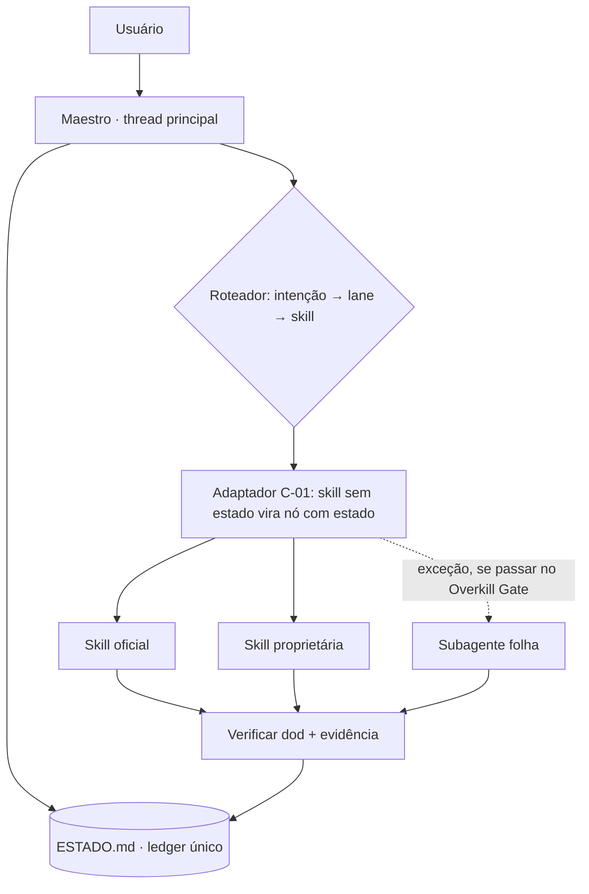

<!-- Referência ingerida em ING-0002 a partir de ING-0002:03-arquitetura-alvo/maestro-topologia.md (sha256 04d50f67bf60…). Conteúdo preservado; hipóteses continuam HIPÓTESE.
     Adaptações de caminho: '07-execucao/ESTADO.md' → ledger canônico 07-execucao/estado.json (projeção ESTADO.md); '01-contratos/' → contratos/; '02-mapa/' → mapa/.
     Atualizações seguem change control (I-10): não reescrever; acrescentar nota datada. -->

# Topologia-alvo do Maestro (HIPÓTESE H-arq-1 — E2 decide, com evidência)

> Esta é uma **proposta fundamentada nos fatos verificados** (`divergencias-e-lacunas.md` §6),
> não um projeto fechado. O estágio E2 pode substituí-la desde que registre o motivo (ADR).
> **Critério que governa tudo:** o risco R1 declarado pelo usuário é *overkill, falta de
> eficiência, retrabalho, não aplicabilidade*. Menos peças é a resposta padrão.

## 1. Princípio

```
Maestro  =  UM agente de thread principal  (claude --agent maestro)
Lanes    =  LINHAS DA TABELA DE ROTEAMENTO  (padrão)   ← não são agentes
Subagente = EXCEÇÃO, promovida só se passar no Overkill Gate
```

**Por quê (fatos, não gosto):**
- Thread principal: a doc oficial indica a conversa principal quando várias fases compartilham muito contexto (paráfrase) — exatamente o caso aqui: estado, ficha e F0–F8 se referenciam.
- Subagente novo não vê a conversa; o **prompt é o único canal** → cada delegação custa um pacote de handoff (C-04).
- Aninhamento depende da versão do Claude Code (§6) → **lanes são folhas**, o Maestro não depende de spawn em cadeia.

## 2. Fluxo



## 3. Overkill Gate — quando uma lane vira subagente

Promover **somente se ≥ 1** for verdadeiro **e** as 4 respostas de `C-02` (Reuso, Necessidade, Custo, Reversão) existirem por escrito:

| # | Critério | Exemplo provável |
|---|---|---|
| G1 | **Saída volumosa** que poluiria o contexto principal | pesquisa de evidências (`rc`, `executar-safe-frameworks`) |
| G2 | **Restrição de ferramenta** que o prompt sozinho não garante | revisor **somente leitura** (QA); DevOps sem produção |
| G3 | **Paralelismo real** de trabalho independente | derivados de 3 packs; vídeo × newsletter |

**Candidatos (HIPÓTESE, ordenados por probabilidade de passar):**

| Candidato | Critério | Ferramentas (menor privilégio) | Observação |
|---|---|---|---|
| `qa-reviewer` | G2 | `Read, Grep, Glob, Bash(somente leitura)` | revisão **independente** de quem produziu |
| `evidence-researcher` | G1 | `Read, Grep, WebSearch, WebFetch`; sem `Write` fora de `evidencias/` | trata web como **dado** (I-07) |
| `editorial-worker` | G3 | `Read, Write` no escopo do pack | só se houver ≥ 2 packs em paralelo |

Todas as outras lanes (Produto, Engenharia, Design, DevOps, Stakeholders, Operações) começam como
**linhas de roteamento**. Se em E6 alguma mostrar poluição de contexto ou violação de escopo, ela é promovida (com ADR).

> **Teto sugerido:** ≤ 4 subagentes na v0. A doc oficial avisa quando as descrições somadas passam de
> 15.000 tokens — descrições curtas; detalhe vai no corpo do agente.

## 4. Imposição por hook, não só por pedido

A doc verificou: hook `PreToolUse` com saída `exit 2` **bloqueia** a chamada e vale dentro de subagentes.
Para invariantes que **não podem** depender de o modelo "lembrar":

| Invariante | Mecanismo candidato |
|---|---|
| I-05 (efeito externo exige aprovação) | `PreToolUse` em `Bash`/conectores de escrita → exige marca de autorização no nó |
| Escopo de escrita (C-04) | `PreToolUse` em `Write/Edit` → bloqueia caminhos fora do escopo do nó |
| I-01 (WIP=1) | validador do ledger chamado por hook ou script do `check` |

⚠️ **Onde o hook mora importa.** Subagente **vindo de plugin ignora** `hooks`/`mcpServers`/`permissionMode`
no frontmatter. Portanto: guardrails em `settings.json` do projeto ou em `hooks/hooks.json` do **plugin**
(nível do plugin), **nunca** só no frontmatter do agente. Teste: EV-010.

## 5. Distribuição

| Modo | Quando | Condição |
|---|---|---|
| **A. Projeto** (`.claude/agents`, `.claude/skills`, `CLAUDE.md`, `settings.json`) | **v0 — padrão** | nenhuma |
| **B. Plugin** (`.claude-plugin/plugin.json` + `agents/ skills/ commands/ hooks/`) | após D6 e EV-010 | manifesto opcional; guardrails no nível do plugin |
| **C. Agent SDK** | **fora do escopo agora** (você opera via Claude Code) | registrar como futuro; não construir |

## 6. Relação com o Copiloto (D11 — confirmar)

O Copiloto já governa a rotina diária sobre o `EXECUTAR_CONTROL_CENTER`. **O Maestro não o
substitui:** orquestra **produção e engenharia** (lanes) e, para estado operacional, **lê e projeta**
via os contratos do Copiloto (C-01, opção C). Proposta de nome/escopo: *Maestro = orquestração de
entrega; Copiloto = rotina e estado diário.* Evitar colisão de nomes com "PRISMA" (já usado no sistema
de cards A4) — não reutilizar o termo.

## 7. Walking skeleton (v0) — o mínimo que prova o sistema

1. `CLAUDE.md` (regras permanentes; C-00 referenciado, não copiado).
2. `.claude/agents/maestro.md` (thread principal; `tools: Agent(<allowlist>), Read, Grep, Glob, Write, Edit, Bash, Skill`).
3. `07-execucao/ESTADO.md` (ledger, C-01) + **um validador** (WIP=1; `DONE` exige evidência).
4. Tabela de roteamento (arquivo único).
5. **Uma** lane ponta a ponta sobre **um** nó real.
6. Eval Suite (semente) rodando.

**Não fazer na v0:** plugin, Agent SDK, novas skills, mais de 1 lane real, dashboard, memória de agente.

## 8. Estrutura de repositório alvo (mínima)

```
maestro/
├── CLAUDE.md
├── .claude/
│   ├── agents/          # maestro.md (+ ≤ 4 folhas, se aprovadas)
│   └── settings.json    # hooks e permissões (guardrails)
├── contratos/           # C-00 … C-04 (referência única)
├── mapa/                # roteamento, inventário, F0–F8, ficha
├── 07-execucao/ESTADO.md
└── evals/               # C-03 em casos executáveis
```
